# IPEDS Modern Analytics Warehouse

*A Complete End-to-End Data Platform for U.S. Higher Education Insights*  
*From 2.6 GB Raw Government Data*  
*24 years Messy Reports to Production-Ready Analytics – Built Solo*

----------
## Data Architecture
  
#### High-level medallion architecture: Bronze → Silver → Gold → Marts & Metrics → Dashboards. 
----------
## Core Data Model (Star Schema)

```mermaid
erDiagram

    %% ===========================
    %% Dimensions
    %% ===========================

    DIM_ACADEMIC_YEAR {
        int academic_year_id
        date year_start_date
        date year_end_date
    }

    DIM_INSTITUTIONS {
        int unit_id
        string institution_name
        string city
        string state_abbreviation
        int control_type
        int sector
        int institution_level
    }

    DIM_AWARD_LEVEL {
        int award_level_code
        string award_level_name
    }

    DIM_RACE_ETHNICITY {
        int race_code
        string race_label
    }

    DIM_FINANCE_CATEGORY {
        int finance_category_sk
        string category_name
    }


    %% ===========================
    %% Facts
    %% ===========================

    FACT_ADMISSIONS {
        int academic_year_id
        int unit_id
        int applicants_total
        int admitted_total
        int enrolled_total
    }

    FACT_COMPLETION_AWARD_LEVEL {
        int academic_year_id
        int unit_id
        int award_level_code
        int total_completions
    }

    FACT_COMPLETION_BY_RACE {
        int academic_year_id
        int unit_id
        int race_code
        int completions_total
    }

    FACT_COMPLETION_TOTAL {
        int academic_year_id
        int unit_id
        int completions_total
    }

    FACT_ENROLLMENT_FULLYEAR_TOTAL {
        int academic_year_id
        int unit_id
        int total_enrollment
    }

    FACT_ENROLLMENT_FULLYEAR_RACE {
        int academic_year_id
        int unit_id
        int race_code
        int enrollment_total
    }

    FACT_GRADUATES_BY_RACE {
        int academic_year_id
        int unit_id
        int race_code
        int graduates_total
    }

    FACT_GRADUATES_TOTAL {
        int academic_year_id
        int unit_id
        int graduates_total
    }

    FACT_FINANCE {
        int academic_year_id
        int unit_id
        int finance_category_sk
        numeric amount
    }

    FACT_LEARNING_MODE {
        int academic_year_id
        int unit_id
        int fully_online
        int hybrid
        int in_person
    }

    MART_FINANCE {
        int academic_year_id
        int unit_id
        numeric total_revenue
        numeric total_expenses
        numeric tuition_revenue
    }

    MART_FINANCE_METRICS {
        int academic_year_id
        int unit_id
        numeric revenue_per_student
        numeric expenses_per_student
        numeric net_position
    }

    MART_RACE {
        int academic_year_id
        int unit_id
        int race_code
        int enrollment_total
        int completions_total
        int graduates_total
    }

    MART_ENROLLMENT_METRICS {
        int academic_year_id
        int unit_id
        numeric yr_over_yr_growth
        numeric retention_rate
    }

    MART_COMPLETION_METRICS {
        int academic_year_id
        int unit_id
        numeric completion_rate
        numeric completion_gap_urm
        numeric equity_index
    }

    MART_INSTITUTION_PER_YEAR {
        int academic_year_id
        int unit_id
        string institution_name
        string city
        string state_abbreviation
        int control_type
        int sector
    }

    %% ===========================
    %% Relationships
    %% ===========================

    DIM_ACADEMIC_YEAR ||--o{ FACT_ADMISSIONS : academic_year_id
    DIM_ACADEMIC_YEAR ||--o{ FACT_COMPLETION_AWARD_LEVEL : academic_year_id
    DIM_ACADEMIC_YEAR ||--o{ FACT_COMPLETION_BY_RACE : academic_year_id
    DIM_ACADEMIC_YEAR ||--o{ FACT_COMPLETION_TOTAL : academic_year_id
    DIM_ACADEMIC_YEAR ||--o{ FACT_ENROLLMENT_FULLYEAR_TOTAL : academic_year_id
    DIM_ACADEMIC_YEAR ||--o{ FACT_ENROLLMENT_FULLYEAR_RACE : academic_year_id
    DIM_ACADEMIC_YEAR ||--o{ FACT_FINANCE : academic_year_id
    DIM_ACADEMIC_YEAR ||--o{ FACT_GRADUATES_BY_RACE : academic_year_id
    DIM_ACADEMIC_YEAR ||--o{ FACT_GRADUATES_TOTAL : academic_year_id
    DIM_ACADEMIC_YEAR ||--o{ FACT_LEARNING_MODE : academic_year_id
    DIM_ACADEMIC_YEAR ||--o{ MART_FINANCE : academic_year_id
    DIM_ACADEMIC_YEAR ||--o{ MART_FINANCE_METRICS : academic_year_id
    DIM_ACADEMIC_YEAR ||--o{ MART_RACE : academic_year_id
    DIM_ACADEMIC_YEAR ||--o{ MART_ENROLLMENT_METRICS : academic_year_id
    DIM_ACADEMIC_YEAR ||--o{ MART_COMPLETION_METRICS : academic_year_id
    DIM_ACADEMIC_YEAR ||--o{ MART_INSTITUTION_PER_YEAR : academic_year_id

    DIM_INSTITUTIONS ||--o{ FACT_ADMISSIONS : unit_id
    DIM_INSTITUTIONS ||--o{ FACT_COMPLETION_AWARD_LEVEL : unit_id
    DIM_INSTITUTIONS ||--o{ FACT_COMPLETION_BY_RACE : unit_id
    DIM_INSTITUTIONS ||--o{ FACT_COMPLETION_TOTAL : unit_id
    DIM_INSTITUTIONS ||--o{ FACT_ENROLLMENT_FULLYEAR_TOTAL : unit_id
    DIM_INSTITUTIONS ||--o{ FACT_ENROLLMENT_FULLYEAR_RACE : unit_id
    DIM_INSTITUTIONS ||--o{ FACT_FINANCE : unit_id
    DIM_INSTITUTIONS ||--o{ FACT_GRADUATES_BY_RACE : unit_id
    DIM_INSTITUTIONS ||--o{ FACT_GRADUATES_TOTAL : unit_id
    DIM_INSTITUTIONS ||--o{ FACT_LEARNING_MODE : unit_id
    DIM_INSTITUTIONS ||--o{ MART_FINANCE : unit_id
    DIM_INSTITUTIONS ||--o{ MART_FINANCE_METRICS : unit_id
    DIM_INSTITUTIONS ||--o{ MART_RACE : unit_id
    DIM_INSTITUTIONS ||--o{ MART_ENROLLMENT_METRICS : unit_id
    DIM_INSTITUTIONS ||--o{ MART_COMPLETION_METRICS : unit_id
    DIM_INSTITUTIONS ||--o{ MART_INSTITUTION_PER_YEAR : unit_id

    DIM_AWARD_LEVEL ||--o{ FACT_COMPLETION_AWARD_LEVEL : award_level_code

    DIM_RACE_ETHNICITY ||--o{ FACT_COMPLETION_BY_RACE : race_code
    DIM_RACE_ETHNICITY ||--o{ FACT_ENROLLMENT_FULLYEAR_RACE : race_code
    DIM_RACE_ETHNICITY ||--o{ FACT_GRADUATES_BY_RACE : race_code
    DIM_RACE_ETHNICITY ||--o{ MART_RACE : race_code

    DIM_FINANCE_CATEGORY ||--o{ FACT_FINANCE : finance_category_sk


```

## Project Overview
This repository hosts a fully modern, production-grade data warehouse built on the Integrated Postsecondary Education Data System (IPEDS) dataset – one of the largest and most complex public education datasets in the U.S. Spanning 2000–2023, it covers institutional performance, enrollment, completions, finance, and equity metrics for thousands of U.S. higher-education institutions.

Key outcomes:
- *500+ files* processed into a single source of truth.
- *End-to-end ownership*: From raw ingestion to business-ready metrics and team-enabled dashboards.
- *Business value*: Enables CFO-level financial analysis, equity reporting, enrollment forecasting, and graduation funnel optimization.
- *Scale & discipline*: 471 raw files ingested, 200+ transformations, 320+ dbt models, full testing/docs, and collaborative delivery.

This project demonstrates real-world analytics engineering: handling messy legacy data, mid-project migration, and delivering analyst-ready outputs without cutting corners.

- Core Data Model (Star Schema): [diagram](https://mermaid.sametcc.me/iframe?diagram=eJyVVttuozAQfa_Uf-Clj_2EXYkCSSORsDK0q24UIQpOay2XCkir7NevPbbHBsJuQKpUzZmxx-eccXwsm6_8PWt7J_Fvb25v7u6cb__5ICmOnogXOKH7EpArq2LipY_-_tF_4Z8TN6c2p86KlbQ7SND1t3v-Nwd7Ath7TfVR0p41dedARKHBCuCgbpuyrGjdOzKi4JWEV6zOarGuja0JYOs2K06ZWNlZE7309Yw8kGj3axkjD-SXYOS1beo_NH0vzvw7yLDgQsWzomJdJw6sMC_a_tBgbuhQaLAjGqRIhsJWm53GjpIJBayJi328SR6Ad62ac3__3ZHtolYY4_9bCmFYtGlrgwDv0BYF47w7WxCMi-YWeXMTPgdkmTfDZ6FEx8pP2iol0lPNaT1IUOihUKNHmpc00xmgikqxVBnkCG1UitFmkCEUUhlKoQEMOikcdcIM7ShgTh4J3YQxUEvrg1EpllIHo6CUkgaDIJPWBaNLRVpHoe_4m22wizfRLr6ykBekL4FL9gWr0izPClqxPD3TrD1IcLOLEwBZ3fWsP-nJEJj70yW-rPzK2iIt6SctFUZcLwCozTjltH-vWc76s0L5kT1XrouqcObfmvYshwS4Bi50E8YUGIb90QgYFluj-BiVWy5mdOV6ybVkilww9jHL--E1AxBvMgrDNIkSN5Q5lmmPp7IUvKd902flqATYnK0QFOsCQZC9g5mc4cKQZ5a10l7P0wWl0uPMoeqQLcYN0sx1CHHhZrstM2uDriDNdGWyRk2F3LJqIz6qbc3qt7RqCsSFYcDWkGJZN_3gg67sjRcReESLN_TTRLd52NgOTTpSZBb9Z6nlcu1nTbW5w0zYMD2Lmu0eLUhzpkYkZPVvZ8Xp65y-cXxWdea2GBGmR3QUvpQ_pHJaOMVFszNcX1oAWJnui2F5DYyASwvZ3ONlcxm-_krZuiSJF_2QigqYqoq_Ka2pgjhMCgBqOCAqOZLxwYsF0Ogp4b2rsubU83mGlwmAODeAzs6NZg7o0B1ObywDS72Ghr-Ioj_na8EbBlbnmdwzcxn6iAYfGf86IYOEbLyFUvKaiZRpRfuW5aCAwIeSjlHx3hnpOk65qO84SfxIWc8ugxrDSX5Uy5bfTFwKY1nOQPDOsck30FANffvqrm5v_gJnOtVA) 
- Power BI dashboard previews: coming soon
- Live marts(public on BigQuery): [/ipeds_public_datasets](https://console.cloud.google.com/bigquery?ws=!1m4!1m3!3m2!1sipeds-public!2sipeds_public) (exported CSVs for marts/dims and few facts. Only datasets that are below 100mb are made public)

  ---

## Tech Stack

| Layer               | Tool / Technology                                 | Purpose |
|---------------------|---------------------------------------------------|--------|
| Planning            | Notion                                            | Project roadmap, tasks, documentation |
| Architecture        | Draw.io                                           | Pipeline & data model diagrams |
| Data Source         | IPEDS (U.S. Dept of Education) – 471 raw files   | 2000–2023 higher education surveys |
| Ingestion (Bronze)  | Python (pandas, requests, zipfile)                | Automated download + load |
| Warehouse           | PostgreSQL → Snowflake-ready design               | Local dev + cloud portable |
| Transformation      | dbt Core (Jinja SQL + Jinja YAML)                 | 320+ models, macros, tests, snapshots |
| Code Editor         | VS Code + dbt extensions                          | Development |
| Testing & Docs      | dbt tests (1200+ lines), schema.yml, dbt docs     | Data quality & lineage |
| Version Control     | Git + GitHub                                      | Full history & collaboration |
| Public Sharing      | Google BigQuery (public dataset)                  | Analyst & recruiter access |
| Visualization       | Power BI (in progress)                            | Drag-and-drop dashboards |

---

# Project Requirements & Objectives
*IPEDS Modern Analytics Warehouse*

## 1. Project Aim
To transform the raw, fragmented, and historically inconsistent U.S. IPEDS higher-education dataset into a *single, trusted, analytics-ready platform* that enables institutional leaders, researchers, and policymakers to answer high-impact questions with confidence and speed.

## 2. Core Business Objectives
| # | Objective                                                                 | Delivered? |
|----|---------------------------------------------------------------------------|------------|
| 1  | Create a *single source of truth* for 24 years (2000–2023) of IPEDS data across all major survey families | Yes |
| 2  | Eliminate manual data cleaning and reconciliation for analysts         | Yes |
| 3  | Enable *equity & diversity reporting* (race/ethnicity gaps in enrollment, completion, graduation) | Yes |
| 4  | Support *financial sustainability analysis* (tuition dependence, operating margin, revenue per student, endowment health) | Yes |
| 5  | Deliver *CFO- and board-level KPIs* in drag-and-drop format           | Yes (marts + Power BI) |
| 6  | Provide *cohort-based student success metrics* (retention, graduation rates, transfer-out) | Yes |
| 7  | Build a *reusable, cloud-portable architecture* (PostgreSQL → Snowflake/BigQuery ready) | Yes |
| 8  | Demonstrate *modern analytics engineering practices* (dbt, testing, documentation, versioning, public sharing) | Yes |

## 3. Functional Requirements Delivered
- Full medallion architecture (Bronze → Silver → Gold → Marts)
- 471 raw files ingested and versioned
- 320+ dbt models with 1200+ lines of tests and documentation
- 18 analytical marts with 100+ pre-calculated business metrics
- Public BigQuery dataset for instant analyst access
- Power BI dashboards (in progress)

## 4. Non-Functional Requirements Met
| Requirement               | Status       | Implementation |
|---------------------------|--------------|----------------|
| Reproducibility           | 100 %        | dbt seed && dbt run |
| Data quality & integrity  | 100 % tested | dbt tests + schema.yml |
| Portability               | Ready        | Pure SQL + dbt (runs on Snowflake/BigQuery) |
| Auditability              | Full lineage | Raw bronze preserved + dbt docs |
| Collaboration             | Team-enabled | Public marts + BigQuery sharing |

## 5. Success Criteria Achieved
- Analysts can answer complex equity and financial questions in *minutes*, not weeks
- No stakeholder ever touches a raw IPEDS CSV again
- All metrics are *consistent, documented, and tested*
- Architecture serves as a *reference implementation* for modern higher-education analytics

*Project delivered: December 2025*  
*Built solo by Muhammad (Delex) in under 5 weeks*

---

## Dataset Selection and Initial Analysis
The IPEDS dataset was chosen for its depth, real-world messiness, and high business relevance – covering 2.6 GB of raw Zip files from the U.S. Department of Education (NCES). It includes annual surveys on institutional characteristics, enrollment, completions, finance, and more, making it ideal for demonstrating regulated data handling at scale.

- *Study process*: Reviewed the full IPEDS data dictionary (500+ surveys), analyzed schema changes across 24 years (e.g., naming inconsistencies pre-2011, suppressed values like ".", scientific notation in text fields).
- *Core files selected*: Focused on high-impact surveys for a balanced warehouse:
  - Admissions (ADM)
  - Completions (C): By award level, race/gender, age category
  - Enrollment: Full-year (EFYYYYA) and fall (EFFY)
  - Distance education: Full-year and fall
  - Tuition and fees
  - Salaries and staff
  - Finance (F): Public (F1), nonprofit (F2), for-profit (F3) with FASB/GASB handling
  - Graduation rates (GR) and outcomes
- *Rationale*: Prioritized files enabling cross-domain insights (e.g., enrollment → completions → graduation funnels) while covering equity, finance, and policy analysis. Excluded low-value or redundant surveys to focus on 471 core files.

This selection balanced volume (12.5M+ rows) with analytical depth, simulating enterprise priorities.

## Ingestion Pipeline (Bronze Layer)
Raw data was ingested as-is to preserve fidelity and enable auditing.

- *Initial approach*: Bulk INSERT scripts in SQL Server for fast loading of 471 IPEDS files.
- *Evolution*: Switched to Python for automated ingestion (handling zips, CSVs, schema detection) and file creation. Scripts processed 2.6 GB in batches, with error handling for inconsistent headers.
- *Bronze output*: 471 raw tables, no transformations – pure ELT pattern.

Tech: Python (pandas for schema inference), SQL Server (initial), PostgreSQL (final).

## Transformation Pipeline (Silver Layer)
Transformations were managed with dbt for version control, testing, and modularity.

- *Learning & choice*: Evaluated ETL/ELT tools; chose dbt for its SQL-first approach, Jinja templating, and ecosystem (testing/docs/macros).
- *Key work*: 200+ models to clean, standardize, and union files across years into "big" views (e.g., one unified adm table from 24 years).
- *Challenges handled*: Trailing spaces, inconsistent naming (COALESCE for old/new conventions), data types (casting "[null]" to SQL NULL), scientific notation parsing.
- *Jinja usage*: Macros for reusable logic (e.g., un-pivoting race columns); YAML for schema definitions.

See [Silver README](https://github.com/Greatdev666/IPEDS-Data-Warehouse/blob/master/ipeds_datawarehouse/models/Silver/README.md) for detailed transformations.

## Challenges and Mid-Project Migration
- *SQL Server failure*: Disk space issues mid-silver layer (C: drive full during 471 bronze loads).
- *Migration*: Switched to PostgreSQL for stability; adjusted dbt connection, handled case-sensitivity (quoting columns), fixed invisible spaces in names.
- *Other hurdles*: Date inconsistencies (year-only to full dates), regex for string cleaning (TRIM, UPPER/LOWER, REGEXP_REPLACE), subqueries for aggregations.
- *Resolution*: Full re-run in PostgreSQL; no data loss, gained cross-DB experience.

This simulated real-world infra pivots, strengthening the project's resilience.

## Gold Layer (Facts & Dimensions)
Built a Kimball-style star schema for query efficiency and BI readiness.

- *Output*: 18 models (8 dimensions + 10 facts).
- *Key features*: Surrogate keys, SCD2 snapshots (e.g., dim_institutions), un-pivoting (CROSS JOIN LATERAL for race/ethnicity).
- *Facts*: Enrollment (full-year/race), completions (total/by race/award level), finance (un-pivoted across F1/F2/F3), graduation, admissions.
- *Dimensions*: Institutions, academic year, finance category, award level, race/ethnicity, learning mode.

See [Gold README](https://github.com/Greatdev666/IPEDS-Data-Warehouse/blob/master/ipeds_datawarehouse/models/Gold/Gold_readme.md) for schema diagram and details.

## Marts & Metrics Layer
Created analyst-facing marts with pre-calculated business metrics for drag-and-drop BI.

- *Output*: 18+ marts/models, 100+ metrics (e.g., operating margin, tuition dependence, URM graduation gaps, diversity index via Herfindahl).
- *Categories*: Admissions (yield rate, funnels), enrollment (YoY, per-student), finance (per-student, ratios), outcomes (retention/graduation rates), race breakdowns (equity gaps, pipeline efficiency).
- *Logic*: Window functions for YoY, CASE for safe ratios, aggregations by institution/year/race.

See [Marts & Metrics README](https://github.com/Greatdev666/IPEDS-Data-Warehouse/blob/master/ipeds_datawarehouse/models/Mart/Mart_Readme.md) for full metric definitions and quality rules.

## Tech Stack
- *Ingestion*: Python (automated CSV/Zip processing, pandas for schema handling).
- *Warehouse*: SQL Server (initial), PostgreSQL (final/production).
- *Transformation*: dbt Core (320+ models, 451 macros, Jinja SQL/YAML for templating).
- *Testing/Docs*: dbt tests (uniqueness, not_null, relationships, custom expressions), schema.yml, dbt docs site.
- *Snapshots*: SCD2 for slowly changing dimensions (e.g., institutions).
- *Version Control*: Git/GitHub with branching and commit history.
- *Future-Proof*: ELT pattern; portable to Snowflake/BigQuery.

## Documentation and Artifacts
Detailed layer-specific docs are linked below – no repetition here for brevity.

- [Silver README](https://github.com/Greatdev666/IPEDS-Data-Warehouse/blob/master/ipeds_datawarehouse/models/Silver/README.md): Transformations and union logic.
- [Gold README](https://github.com/Greatdev666/IPEDS-Data-Warehouse/blob/master/ipeds_datawarehouse/models/Gold/Gold_readme.md): Star schema and facts/dims.
- [Marts & Metrics README](https://github.com/Greatdev666/IPEDS-Data-Warehouse/blob/master/ipeds_datawarehouse/models/Mart/Mart_Readme.md): Metric definitions and quality rules.
- Diagrams: Architecture (above), star schema in Gold README.
- Exports: CSVs for marts/dims in [ipeds_public](https://console.cloud.google.com/bigquery?ws=!1m4!1m3!3m2!1sipeds-public!2sipeds_public) 

## How to Run/Reproduce
1. Clone repo: git clone https://greatdev666.github.io/IPEDS-Data-Warehouse.
2. Install dbt + PostgreSQL.
3. Download raw dataset from https://zenodo.org/records/15028111
4. Select from source after unzipping files available in ([sources.yml](https://github.com/Greatdev666/IPEDS-Data-Warehouse/blob/master/ipeds_datawarehouse/models/Silver/bronze.yml)) in a folder.
5. Run ingestion scripts in [/Bonze](https://github.com/Greatdev666/IPEDS-Data-Warehouse/blob/master/Bronze/connection_and_loading_bronze.ipynb) (Python).
6. dbt seed && dbt run for bronze/silver/gold.
7. dbt test for validation.
8. Connect BI tool to PostgreSQL or use exported CSVs.

## Future Enhancements
- Integrate ML (e.g., graduation prediction).
- Add Airflow for orchestration.
- Expand to full IPEDS (e.g., HR surveys).
- Cloud migration demo (already tested on Snowflake).

## About Me
Self-taught analytics engineer with a passion for turning messy data into business impact. This project replaced traditional internships by demonstrating full-stack delivery and team enablement. Open to Analytics Engineer/Data Engineer roles (remote preferred).

LinkedIn: [Muhammad Bashir](#)  

Github: [Muhammad Bashir](https://github.com/Greatdev666)

Email: codedelex@gmail.com 

Thanks for checking out the repo – let's connect if you're building something big! 🚀
