# Gold Layer - IPEDS Data Warehouse

## Overview

The **Gold layer** in our data warehouse represents the curated, business-ready datasets that are optimized for analytics and reporting. This layer builds upon the Bronze (raw) and Silver (cleaned/transformed) layers, integrating multiple sources into a **star-schema design** that supports complex institutional analytics.

We currently have **8 dimension tables** and **10 fact tables**, designed to provide insights into institutional performance, enrollment, completion, finance, and demographics.

---

## Dimension Tables

Dimension tables provide **descriptive context** for facts, enabling meaningful aggregation and filtering.  

| Dimension Table | Purpose | Notes |
|-----------------|---------|-------|
| `dim_academic_year` | Contains academic year information for aligning metrics over time. | Used for all temporal analysis. |
| `dim_age_category` | Categorizes student ages into meaningful ranges. | Not yet used in current facts but useful for age-based analytics. |
| `dim_award_level` | Defines the type/level of awards or degrees (Associate, Bachelor’s, Master’s, etc.). | Used in completion facts. |
| `dim_finance_category` | Defines financial metrics (Balance Sheet, Revenue, Expenses) used in `fact_finance`. | Includes categories, subgroups, and descriptions. |
| `dim_gender` | Represents gender categories. | Not currently used directly in any fact, but gender breakdowns exist in several fact tables. |
| `dim_institutions` | Contains metadata about institutions (UNITID, name, type, etc.). | Central reference for all fact tables. |
| `dim_learning_mode` | Defines learning modes such as fully online, in-person, or hybrid. | Used in enrollment and learning mode analysis. |
| `dim_race_ethnicity` | Defines nine race/ethnicity categories for demographic analysis. | Used in student enrollment, completion, and graduation metrics. |

---

## Fact Tables

Fact tables store **measurable metrics** and link to dimensions via foreign keys. They are designed to allow both granular and aggregated reporting.

| Fact Table | Purpose | Notes |
|------------|---------|-------|
| `fact_admissions` | Tracks admissions metrics for institutions. | Can be analyzed by academic year, race, gender, and other dimensions. |
| `fact_completion_award_level` | Tracks completions by award level. | Linked to `dim_award_level` for detailed analysis. |
| `fact_completion_by_race` | Tracks completions by race, including gender breakdowns. | Supports demographic performance analysis. |
| `fact_completions_total` | Total completions including gender breakdown (male/female). | Aggregated completion metrics for reporting. |
| `fact_enrollment_fullyear_total` | Tracks full-year enrollment totals by gender. | Supports overall enrollment analytics. |
| `fact_enrollment_fullyear_race` | Tracks full-year enrollment by race, including gender breakdown. | Useful for diversity and equity reporting. |
| `fact_finance` | Tracks financial metrics (assets, liabilities, revenues, expenses) per institution and year. | Includes finance type (F1: public, F2: nonprofit, F3: for-profit). |
| `fact_graduates_by_race` | Tracks graduates by race and gender. | Supports demographic and program analysis. |
| `fact_graduates_total` | Total graduates including gender breakdown (male/female). | Aggregated graduation metrics for reporting. |
| `fact_learning_mode` | Tracks enrollments or completions by learning mode. | Enables online, hybrid, and in-person analysis. |

---

## Star Schema Diagram

```mermaid
erDiagram
    DIM_ACADEMIC_YEAR ||--o{ FACT_ADMISSIONS : "year"
    DIM_ACADEMIC_YEAR ||--o{ FACT_COMPLETION_AWARD_LEVEL : "year"
    DIM_ACADEMIC_YEAR ||--o{ FACT_COMPLETION_BY_RACE : "year"
    DIM_ACADEMIC_YEAR ||--o{ FACT_COMPLETION_TOTAL : "year"
    DIM_ACADEMIC_YEAR ||--o{ FACT_ENROLLMENT_FULLYEAR_TOTAL : "year"
    DIM_ACADEMIC_YEAR ||--o{ FACT_ENROLLMENT_FULLYEAR_RACE : "year"
    DIM_ACADEMIC_YEAR ||--o{ FACT_FINANCE : "year"
    DIM_ACADEMIC_YEAR ||--o{ FACT_GRADUATES_BY_RACE : "year"
    DIM_ACADEMIC_YEAR ||--o{ FACT_GRADUATES_TOTAL : "year"
    DIM_ACADEMIC_YEAR ||--o{ FACT_LEARNING_MODE : "year"

    DIM_FINANCE_CATEGORY ||--o{ FACT_FINANCE : "finance_category_sk"
    DIM_AWARD_LEVEL ||--o{ FACT_COMPLETION_AWARD_LEVEL : "award_level_sk"
    DIM_RACE_ETHNICITY ||--o{ FACT_COMPLETION_BY_RACE : "gender_sk"
    DIM_INSTITUTIONS ||--o{ FACT_COMPLETION_TOTAL : "gender_sk"
    DIM_INSTITUTIONS ||--o{ FACT_ENROLLMENT_FULLYEAR_TOTAL : "gender_sk"
    DIM_RACE_ETHNICITY ||--o{ FACT_ENROLLMENT_FULLYEAR_RACE : "gender_sk"
    DIM_RACE_ETHNICITY ||--o{ FACT_COMPLETION_BY_RACE : "race_sk"
    DIM_RACE_ETHNICITY ||--o{ FACT_ENROLLMENT_FULLYEAR_RACE : "race_sk"
    DIM_RACE_ETHNICITY ||--o{ FACT_GRADUATES_BY_RACE : "race_sk"
    DIM_INSTITUTIONS ||--o{ FACT_ADMISSIONS : "unit_id"
    DIM_INSTITUTIONS ||--o{ FACT_COMPLETION_AWARD_LEVEL : "unit_id"
    DIM_INSTITUTIONS ||--o{ FACT_COMPLETION_BY_RACE : "unit_id"
    DIM_INSTITUTIONS ||--o{ FACT_COMPLETION_TOTAL : "unit_id"
    DIM_INSTITUTIONS ||--o{ FACT_ENROLLMENT_FULLYEAR_TOTAL : "unit_id"
    DIM_INSTITUTIONS ||--o{ FACT_ENROLLMENT_FULLYEAR_RACE : "unit_id"
    DIM_INSTITUTIONS ||--o{ FACT_FINANCE : "unit_id"
    DIM_INSTITUTIONS ||--o{ FACT_GRADUATES_BY_RACE : "unit_id"
    DIM_INSTITUTIONS ||--o{ FACT_GRADUATES_TOTAL : "unit_id"
    DIM_INSTITUTIONS ||--o{ FACT_LEARNING_MODE : "unit_id"
```


---
## Key Features

- **Star Schema Design:** Dimensions link to facts through surrogate & primary keys to support high-performance queries.
- **Demographic Breakdown:** Gender and race/ethnicity are included in multiple fact tables for diversity and equity analytics.
- **Temporal Analysis:** All facts include `year` references from `dim_academic_year`.
- **Financial Analysis:** `fact_finance` provides a comprehensive view of institutional financials by finance type.
- **Flexible Learning Analytics:** `dim_learning_mode` and `fact_learning_mode` support hybrid and fully online learning analyses.
- **Testing & Documentation:** Models include dbt tests (uniqueness, non-null, accepted values, referential integrity) and documentation in ```schema.yml```.

- **Snapshots:** Slowly Changing Dimensions, e.g., ```dim_institutions_snapshot```, track historical changes and ensure up-to-date reporting.
---

## Future Enhancements

- Integrate `dim_age_category` and `dim_gender` fully into all relevant fact tables.
- Add derived metrics such as growth rates, ratios, and year-over-year changes for enrollment, completion, and finance.
- Expand financial types to include more granular categorizations if additional datasets are added.
- Automate documentation updates in dbt to keep the Gold layer README in sync with model changes.

---

## Notes

- All fact tables have been **unpivoted** where appropriate to allow for flexible reporting and aggregation.
- Missing values in metrics are handled as **0** to ensure consistent analysis.
- Foreign keys enforce integrity between dimensions and facts, ensuring reliable joins for analytics.

---

## Contact / Maintainers

- ***Primary Maintainer:*** Single data engineer (self) responsible for ETL/ELT pipeline, dbt modeling, snapshots, tests, and documentation.
- **Users**: Analysts and BI developers can use the Gold layer for reporting, dashboards, and ad-hoc queries.
---

*This Gold layer README provides a complete overview of the current data warehouse structure, facilitating both technical understanding and business usage.*
